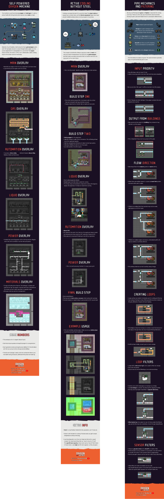

# oni-guides

Guides for **Oxygen Not Included**. If you notice any errors or have any requests for guides please file an issue and I will do my best to respond!

- [Self Powered Oxygen Machine](./self-powered-oxygen-machine.png) ([cheat-sheet](./cheat-sheets/self-powered-oxygen-machine.png))
- [Active Cooling Without Steel](./active-cooling-without-steel.png)
- [Pipe Mechanics and Filtering](./pipe-mechanics-and-filtering.png)
- [Cool Steam Vent Tamer for Mid-game](./cool-steam-vent-tamer-for-mid-game.png)
- [Practical uses for Liquid Loops](./practical-uses-for-liquid-loops.png)
- [Petroleum Boilers](./petroleum-boilers.png)
- [Self Powered Metal Volcano Tamer](./self-powered-metal-volcano-tamer.png) ([cheat-sheet](./cheat-sheets/self-powered-metal-volcano-tamer-cheat-sheet.png))

# Sources

A lot of the builds and information in my guides comes from other content creators. I do my best to mention the creators whose content I've referenced at the end of each guide. The entire list is here (in alphabetical order):

- [Brothgar @ YouTube](https://www.youtube.com/channel/UC1BZnq-fX0Ea4ka4d8cnc0w)
- [Francis John @ YouTube](https://www.youtube.com/channel/UCk6C1z_ErW4XssWUdDSfV7Q)
- [Tony Advanced @ YouTube](https://www.youtube.com/channel/UC3LfCJ2vQi-vSP6JXLG6l5w)

# Preview

  

